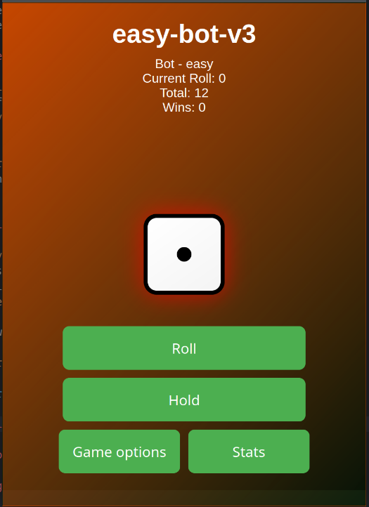

# Documentation: JS-WUERFEL-POKER

Before grading please consider that I even did my documentation in markdown (wow so cool).

---

# 1. Task from Christian Steiner

### Rules

- Two to four players take turns rolling the dice.
- Each player can roll multiple times in a row, with the rolled numbers being added together.
- A player may choose to "hold," adding their accumulated points to their total score.
- Rolling a "1" results in losing the accumulated points for that turn.
- The first player to reach 100 points wins, and their victory is visually highlighted.
- A "New Game" button allows players to restart the game.
- The current game state is visually represented, indicating whose turn it is.
- One player can be replaced by a bot that automatically rolls and makes decisions.

### Bot Logic

- The bot uses a random number generator to roll the dice.
- The rolling process includes an animation for visual effect.
- The bot's decisions (e.g., whether to roll again or hold) are displayed in the user interface for 2 seconds.
- The bot will be optimized to enhance its strategy, increasing the challenge for human players.

## Development Approach

### 1. Wireframe Development

The design process for the game interface was an iterative one, evolving as testing showed areas for improvement.

- **Initial Wireframe**: The game grid initially featured a simple rolling dice animation in the center, with separate player cards displaying each player's current score and status. Buttons for actions like "roll" and "hold" were present alongside the player's card.
- **Feedback from Testing**: Feedback from non-programmers (family members and my girlfriend) revealed that players had difficulty determining whose turn it was and which buttons they should press. Therefore, I implemented changes such as:
  - **Distinct Player Colors**: Each player was assigned a unique color, making it easy to identify players at a glance.
  - **Highlighted Active Player**: The current player's card was visually enlarged, while inactive players' cards were grayed out.
  - **Dedicated Buttons**: Each player had their own "Roll" and "Hold" buttons, reducing confusion and preventing players from accidentally interacting with another player’s controls.
- **Aesthetics**: After resolving functional issues, I focused on improving the visual appeal:
  - **Background Design**: A soft green background with a subtle gradient provided a neutral and visually appealing backdrop.
  - **Card Style**: Player cards were given a gradient effect to simulate lighting from the top-left of the screen, adding depth to the UI.

### 2. Layout Implementation

The layout was developed using **HTML** and **CSS**, focusing on responsiveness and user experience.

- **Flexbox for Layout**: Flexbox was used to create a responsive and flexible layout, ensuring that the game grid adapted smoothly to different screen sizes.
- **CSS Variables & Reusable Classes**: CSS variables were introduced to handle colors and other design elements, promoting consistency throughout the interface. Reusable classes were applied for styling buttons and player cards.

### 3. JavaScript Programming

The core of the game logic was written in **Vanilla JavaScript**, focusing on **Object-Oriented Programming (OOP)** principles for cleaner, maintainable code.

- **Game Logic**: The primary game loop, handling dice rolls, player turns, and the "hold" functionality, was implemented within several key classes.
  - **Player Class**: Handles individual player actions (rolling dice, holding points, etc.).
  - **Bot Class**: Extends the Player class with AI-driven decision-making based on difficulty.
  - **Game Class**: Manages the overall flow of the game, switching between players, tracking scores, and determining the winner.

## Technical Requirements

- The source code adheres to modern web development standards, ensuring that it is clean, well-organized, and free from unused code.
- **No frameworks**: All functionality was implemented using plain JavaScript, CSS, and HTML. No external libraries (like Bootstrap) were used.
- The game is **standalone** and can be run via LocalHost, providing flexibility for future expansions and modifications.

---

# 2. Planning

The planning phase of the game involved a breakdown into three main stages:

1. **Design**
2. **Coding**
3. **Testing**

## 1. Design

The design stage was essential in laying the groundwork for the game. Initially, I sketched rough UI concepts and game flow ideas, which evolved over time based on feedback.

### Game Elements

- **Rolling Dice**: A dice roll animation would be at the heart of the game, visually appealing and easy to follow.
- **Player Cards**: Each player’s card would display their current score and offer buttons for actions like "roll" and "hold."
- **Current Player Indicator**: I planned to visually highlight the current player to make it clear whose turn it was.

### Early Challenges and Solutions

- **Player Confusion**: Early tests revealed that players were unsure whose turn it was, so I added visual enhancements to highlight the active player.
- **Game Flow**: After a few test runs, I realized that the buttons could be confusing. I decided to give each player their own set of controls, minimizing mistakes.

## **Wireframe**


## Final Design




## 2. Code

### Program Flow

The game was designed to proceed in a loop, with players taking turns, rolling dice, and deciding whether to hold or keep rolling. Here’s the breakdown of the game’s program flow:

1. **Initialization**: The game is initialized, and settings are configured (number of players, difficulty of the bot, etc.).
2. **Player Turn Loop**: Each player takes a turn, during which they can roll the dice or choose to hold their points.
3. **Win Condition**: After each player's turn, the game checks if any player has reached 100 points. If so, the game ends, and the winner is displayed.
4. **Switch Player/Continue**: If no one has won, the game proceeds to the next player.

### Key Classes

- **Player Class**: The main class for both human and bot players. It contains methods to roll dice, accumulate points, and hold points.
- **Bot Class**: A subclass of Player, it automates decision-making based on the set difficulty.
  - The bot decides when to roll or hold based on a combination of random chance and preset strategies.
- **Game Class**: Controls the flow of the game, handles switching turns, and checks for the winner.

---

# 3. Coding

## Overview of settings.js

This script is responsible for **managing player settings** in the game. It handles:

- **Player selection** (number of players, names, colors, and bot settings)
- **User interface interactions** (buttons for increasing/decreasing players)
- **Bot configuration** (difficulty levels, custom AI settings)
- **Local storage management** (saving and loading settings)
- **File upload functionality** (importing game settings from a JSON file)

### Detailed Explanation

#### 1. Strict Mode Activation

```js
"use strict";
```

- Enforces **secure coding practices**, preventing undeclared variables and silent errors.

#### 2. Event Listener for DOMContentLoaded

```js
document.addEventListener("DOMContentLoaded", () => { ... });
```

- Ensures the script runs **only after the DOM is fully loaded**.
- Prevents issues where elements aren’t available when the script executes.

#### 3. Querying DOM Elements

These variables store references to essential elements in the settings UI:

```js
const numPlayersValue = document.getElementById("num-players-value");
const playerSettingsDiv = document.getElementById("player-settings");
const increasePlayersBtn = document.getElementById("increase-players");
const decreasePlayersBtn = document.getElementById("decrease-players");
const uploadSettingsBtn = document.getElementById("upload-settings");
```

- `numPlayersValue`: Displays the number of players.
- `playerSettingsDiv`: Container where player settings are dynamically inserted.
- `increasePlayersBtn` & `decreasePlayersBtn`: Used to modify the number of players.
- `uploadSettingsBtn`: Allows importing game settings from a file.

#### 4. Player Settings Rendering

###### Function: `renderPlayerSettings(numPlayers)`

```js
function renderPlayerSettings(numPlayers) { ... }
```

- Clears the `playerSettingsDiv` and **repopulates it** based on `numPlayers`.
- Retrieves **saved settings** from `localStorage`.
- Generates **dynamic player input fields** (name, color, bot options).
- Attaches **event listeners** to update settings in real-time.

#### 5. Saving Settings to Local Storage

###### Function: `saveSettings()`

```js
function saveSettings() { ... }
```

- Collects all player data.
- Saves the data into `localStorage` for persistence.

#### 6. Importing Settings from a File

###### Event Listener for File Upload

```js
uploadSettingsBtn.addEventListener("click", () => { ... });
```

- Creates a **hidden file input element** to allow users to upload `.json` files.
- Reads and **validates** the file’s content.
- If valid, it **updates the UI and localStorage** with the new settings.

#### 7. Loading Settings on Startup

###### Function: `loadSettings()`

```js
function loadSettings() { ... }
```

- Loads settings from `localStorage`, or sets a **default of 2 players** if no settings exist.

```js
loadSettings();
```

- Ensures that when the page loads, it correctly **restores saved settings**.

---

## Overview of player.js

This JavaScript class, `Player`, encapsulates the behavior of a player in a **dice-based game**, supporting both **human and bot players**.

### Detailed Explanation

#### 1. Constructor

```js
constructor(name, color, isBot = false) {
  this.name = name;
  this.color = color;
  this.isBot = isBot;
  this.currentRoll = 0;
  this.total = 0;
  this.winCount = 0;
  this.turnHistory = [];
}
```

- Initializes a new player instance with:
  - `name`: The player's name.
  - `color`: The assigned color.
  - `isBot`: Boolean flag indicating if the player is a bot.
  - `currentRoll`: Stores the ongoing dice roll total.
  - `total`: Accumulates the player’s total score.
  - `winCount`: Tracks the number of games won.
  - `turnHistory`: Stores details of each turn for analysis.

#### 2. Reset Method

```js
reset() {
  this.currentRoll = 0;
  this.total = 0;
  this.turnHistory = [];
}
```

- Resets the player's stats **without affecting** `winCount`.
- Useful when **starting a new game round**.

#### 3. Holding a Turn (`holdTurn`)

```js
holdTurn() {
  this.total += this.currentRoll;
  this.turnHistory.push({
    rollTotal: this.currentRoll,
    newTotal: this.total,
  });
  this.currentRoll = 0;
  return this.total;
}
```

- The player **decides to stop rolling** and locks in their accumulated score.
- Stores the turn's roll history in `turnHistory`.
- Resets `currentRoll` **without affecting total score**.

---

## Overview of settings.js

This script is responsible for **managing player settings** in the game. It handles:

- **Player selection** (number of players, names, colors, and bot settings)
- **User interface interactions** (buttons for increasing/decreasing players)
- **Bot configuration** (difficulty levels, custom AI settings)
- **Local storage management** (saving and loading settings)
- **File upload functionality** (importing game settings from a JSON file)

### Detailed Explanation

#### 1. Strict Mode Activation

```js
"use strict";
```

- Enforces **secure coding practices**, preventing undeclared variables and silent errors.

#### 2. Event Listener for DOMContentLoaded

```js
document.addEventListener("DOMContentLoaded", () => { ... });
```

- Ensures the script runs **only after the DOM is fully loaded**.
- Prevents issues where elements aren’t available when the script executes.

#### 3. Querying DOM Elements

These variables store references to essential elements in the settings UI:

```js
const numPlayersValue = document.getElementById("num-players-value");
const playerSettingsDiv = document.getElementById("player-settings");
const increasePlayersBtn = document.getElementById("increase-players");
const decreasePlayersBtn = document.getElementById("decrease-players");
const uploadSettingsBtn = document.getElementById("upload-settings");
```

- `numPlayersValue`: Displays the number of players.
- `playerSettingsDiv`: Container where player settings are dynamically inserted.
- `increasePlayersBtn` & `decreasePlayersBtn`: Used to modify the number of players.
- `uploadSettingsBtn`: Allows importing game settings from a file.

#### 4. Player Settings Rendering

###### Function: `renderPlayerSettings(numPlayers)`

```js
function renderPlayerSettings(numPlayers) { ... }
```

- Clears the `playerSettingsDiv` and **repopulates it** based on `numPlayers`.
- Retrieves **saved settings** from `localStorage`.
- Generates **dynamic player input fields** (name, color, bot options).
- Attaches **event listeners** to update settings in real-time.

#### 5. Saving Settings to Local Storage

###### Function: `saveSettings()`

```js
function saveSettings() { ... }
```

- Collects all player data.
- Saves the data into `localStorage` for persistence.

#### 6. Importing Settings from a File

###### Event Listener for File Upload

```js
uploadSettingsBtn.addEventListener("click", () => { ... });
```

- Creates a **hidden file input element** to allow users to upload `.json` files.
- Reads and **validates** the file’s content.
- If valid, it **updates the UI and localStorage** with the new settings.

#### 7. Loading Settings on Startup

###### Function: `loadSettings()`

```js
function loadSettings() { ... }
```

- Loads settings from `localStorage`, or sets a **default of 2 players** if no settings exist.

```js
loadSettings();
```

- Ensures that when the page loads, it correctly **restores saved settings**.

---

## Overview of player.js

This JavaScript class, `Player`, encapsulates the behavior of a player in a **dice-based game**, supporting both **human and bot players**.

### Detailed Explanation

#### 1. Constructor

```js
constructor(name, color, isBot = false) {
  this.name = name;
  this.color = color;
  this.isBot = isBot;
  this.currentRoll = 0;
  this.total = 0;
  this.winCount = 0;
  this.turnHistory = [];
}
```

- Initializes a new player instance with:
  - `name`: The player's name.
  - `color`: The assigned color.
  - `isBot`: Boolean flag indicating if the player is a bot.
  - `currentRoll`: Stores the ongoing dice roll total.
  - `total`: Accumulates the player’s total score.
  - `winCount`: Tracks the number of games won.
  - `turnHistory`: Stores details of each turn for analysis.

#### 2. Reset Method

```js
reset() {
  this.currentRoll = 0;
  this.total = 0;
  this.turnHistory = [];
}
```

- Resets the player's stats **without affecting** `winCount`.
- Useful when **starting a new game round**.

#### 3. Holding a Turn (`holdTurn`)

```js
holdTurn() {
  this.total += this.currentRoll;
  this.turnHistory.push({
    rollTotal: this.currentRoll,
    newTotal: this.total,
  });
  this.currentRoll = 0;
  return this.total;
}
```

- The player **decides to stop rolling** and locks in their accumulated score.
- Stores the turn's roll history in `turnHistory`.
- Resets `currentRoll` **without affecting total score**.

---

## Overview of bot.js

The `Bot` class extends the `Player` class and represents an AI-controlled player with different difficulty levels and decision-making capabilities.

### Detailed Explanation

#### 1. Constructor

```js
constructor(name, color, difficulty = "Medium", customSettings = {}) {
  super(name, color, true);
  this.difficulty = difficulty;
  this.customSettings = customSettings;
  this.setDifficultyParameters();
}
```

- Extends the `Player` class.
- Assigns a difficulty level and applies custom AI settings if provided.
- Calls `setDifficultyParameters()` to initialize AI behavior.

#### 2. Difficulty Settings

###### Function: `setDifficultyParameters()`

```js
setDifficultyParameters() {
  const defaultSettings = {
    Easy: { fixedRolls: 5, targetScore: 15 },
    Medium: { targetScore: 20, riskTolerance: 0.7 },
    Hard: { targetScore: 25, riskTolerance: 0.8, useEndgameStrategy: true },
    Expert: { targetScore: 30, riskTolerance: 0.85, useAdvancedAI: true },
  };

  const settings = this.customSettings.enabled
    ? this.customSettings
    : defaultSettings[this.difficulty] || defaultSettings.Medium;

  Object.assign(this, settings);
}
```

- Defines bot behavior based on difficulty.
- Applies custom settings if enabled.
- Adjusts risk tolerance, target score, and advanced strategies.

#### 3. Decision Logic

###### Function: `shouldRoll(gameState)`

```js
shouldRoll(gameState) {
  if (this.total + this.currentRoll >= gameState.winningScore) return false;

  let riskFactor = this.riskTolerance;

  if (this.useEndgameStrategy && gameState.winningScore - this.total < 50) {
    riskFactor += 0.2;
  }

  return this.currentRoll < this.targetScore && Math.random() < riskFactor;
}
```

- Determines if the bot should roll again or hold.
- Uses risk tolerance and game state to make strategic decisions.

#### 4. Processing a Roll

```js
processRoll(diceValue) {
  if (diceValue === 1) {
    this.currentRoll = 0;
    return false;
  }
  this.currentRoll += diceValue;
  return true;
}
```

- Handles dice rolls and bust scenarios.
- Resets `currentRoll` on rolling a `1`.

#### 5. Holding a Turn

```js
holdTurn() {
  this.total += this.currentRoll;
  this.currentRoll = 0;
}
```

- Locks in accumulated points and resets `currentRoll`.

---

## Overview of leaderboard.js

The `leaderboard.js` file manages player rankings, performance tracking, and sorting mechanisms for the leaderboard.

### Detailed Explanation

#### 1. Loading the Leaderboard

```js
function loadLeaderboard() {
  const winners = JSON.parse(localStorage.getItem("winners")) || [];
  winners.sort((a, b) => b.score - a.score);
  renderLeaderboard(winners);
}
```

- Retrieves stored winners from `localStorage`.
- Sorts players by score in descending order.
- Calls `renderLeaderboard()` to update the UI.

#### 2. Rendering the Leaderboard

```js
function renderLeaderboard(winners) {
  const tableBody = document.querySelector("#leaderboard-table tbody");
  tableBody.innerHTML = "";

  winners.forEach((winner, index) => {
    const row = document.createElement("tr");
    row.innerHTML = `
      <td>${index + 1}</td>
      <td>${winner.name}</td>
      <td>${winner.score}</td>
    `;
    tableBody.appendChild(row);
  });
}
```

- Clears and updates the leaderboard table dynamically.
- Iterates through winners and inserts rows into the table.

#### 3. Sorting and Filtering

```js
document.getElementById("apply-filter").addEventListener("click", () => {
  const filter = document.getElementById("filter").value;
  let sortedWinners = [...winners];

  switch (filter) {
    case "score":
      sortedWinners.sort((a, b) => b.score - a.score);
      break;
    case "date":
      sortedWinners.sort((a, b) => new Date(b.date) - new Date(a.date));
      break;
  }

  renderLeaderboard(sortedWinners);
});
```

- Enables sorting leaderboard data by score or date.
- Updates the leaderboard dynamically based on user selection.

#### 4. Downloading Leaderboard Data

```js
function downloadLeaderboard() {
  const winners = JSON.parse(localStorage.getItem("winners")) || [];
  const dataStr =
    "data:text/json;charset=utf-8," +
    encodeURIComponent(JSON.stringify(winners, null, 2));
  const downloadAnchor = document.createElement("a");
  downloadAnchor.setAttribute("href", dataStr);
  downloadAnchor.setAttribute("download", "leaderboard.json");
  downloadAnchor.click();
}
```

- Converts leaderboard data into a JSON file.
- Triggers a download for the user.

#### 5. Uploading Leaderboard Data

```js
function uploadLeaderboard() {
  const fileInput = document.createElement("input");
  fileInput.type = "file";
  fileInput.accept = "application/json";
  fileInput.addEventListener("change", (event) => {
    const file = event.target.files[0];
    if (!file) return;

    const reader = new FileReader();
    reader.onload = function (e) {
      try {
        const uploadedData = JSON.parse(e.target.result);
        localStorage.setItem("winners", JSON.stringify(uploadedData));
        loadLeaderboard();
      } catch (error) {
        alert("Error processing the file! Ensure it's a valid JSON format.");
      }
    };
    reader.readAsText(file);
  });
  fileInput.click();
}
```

- Allows users to upload and replace leaderboard data.
- Reads and validates JSON file contents.

---

## Overview of game.js

The `game.js` file manages the core gameplay logic, handling turns, dice rolling, player interactions, modals, and overall game flow.

### Detailed Explanation

#### 1. Initializing the Game

```js
function initializeGame() {
  players = loadPlayers();
  currentPlayerIndex = 0;
  gameIsRunning = true;
  updateUI();
}
```

- Loads player data from local storage or default settings.
- Sets the first player to start.
- Sets `gameIsRunning` to `true` to indicate an active game.
- Calls `updateUI()` to refresh the interface.

#### 2. Rolling the Dice

```js
function rollDice() {
  if (!gameIsRunning) return;

  const diceValue = Math.floor(Math.random() * 6) + 1;
  updateDiceUI(diceValue);
  return diceValue;
}
```

- Prevents rolling if the game is not active.
- Generates a random dice roll between 1 and 6.
- Calls `updateDiceUI()` to visually update the dice.

#### 3. Handling Player Turns

```js
function handleTurn() {
  if (!gameIsRunning) return;

  const diceValue = rollDice();
  const player = players[currentPlayerIndex];

  if (diceValue === 1) {
    player.currentRoll = 0;
    switchTurn();
  } else {
    player.currentRoll += diceValue;
  }
}
```

- Ensures turns can only be handled while the game is running.
- Rolls the dice and updates the player’s score.
- If a `1` is rolled, resets the player’s roll and switches turns.

#### 4. Holding the Turn

```js
function holdTurn() {
  if (!gameIsRunning) return;

  const player = players[currentPlayerIndex];
  player.total += player.currentRoll;
  player.currentRoll = 0;
  checkWinCondition(player);
  switchTurn();
}
```

- Prevents holding a turn if the game is not running.
- Adds the player's current roll to their total score.
- Checks if the player has won.
- Switches turns after holding.

#### 5. Checking Win Condition

```js
function checkWinCondition(player) {
  if (player.total >= 100) {
    gameIsRunning = false;
    showWinModal(player);
    saveWinner(player);
  }
}
```

- If a player reaches 100 points, they win the game.
- Stops the game by setting `gameIsRunning` to `false`.
- Displays a modal with the winner's name instead of an alert.
- Calls `saveWinner(player)` to store the winner in local storage.

#### 6. Displaying the Win Modal

```js
function showWinModal(player) {
  document.getElementById("winner-name").textContent = player.name;
  document.getElementById("win-modal").style.display = "block";
}
```

- Updates the modal with the winner's name.
- Displays the win modal when a player wins.

#### 7. Closing the Win Modal

```js
document.getElementById("close-win-modal").addEventListener("click", () => {
  document.getElementById("win-modal").style.display = "none";
  resetGame();
});
```

- Hides the win modal when the close button is clicked.
- Calls `resetGame()` to restart the game.

#### 8. Switching Turns

```js
function switchTurn() {
  currentPlayerIndex = (currentPlayerIndex + 1) % players.length;
  updateUI();
}
```

- Moves to the next player in the rotation.
- Calls `updateUI()` to reflect the active player.

#### 9. Saving Winners

```js
function saveWinner(player) {
  let winners = JSON.parse(localStorage.getItem("winners")) || [];
  winners.push({
    name: player.name,
    score: player.total,
    date: new Date().toISOString(),
  });
  localStorage.setItem("winners", JSON.stringify(winners));
}
```

- Retrieves stored winners from local storage.
- Adds the new winner’s data (name, score, and timestamp).
- Saves the updated list back to local storage.

#### 10. Resetting the Game

```js
function resetGame() {
  players.forEach((player) => {
    player.total = 0;
    player.currentRoll = 0;
  });
  initializeGame();
}
```

- Resets all player scores and current rolls.
- Calls `initializeGame()` to restart the game.

---

## Overview of dice.js

The `dice.js` file manages the dice mechanics, including rolling animation, rendering, and interaction handling.

### Detailed Explanation

#### 1. Initializing the Dice

```js
class Dice {
  constructor() {
    this.value = 1;
    this.diceElement = document.getElementById("dice");
    this.history = [];
    this.renderDots();
  }
}
```

- Sets the initial dice value to `1`.
- Retrieves the dice element from the DOM.
- Initializes an empty history of rolls.
- Calls `renderDots()` to visually display the dice.

#### 2. Rolling the Dice

```js
roll() {
  this.value = Math.floor(Math.random() * 6) + 1;
  this.history.push(this.value);
  if (this.diceElement) {
    this.diceElement.setAttribute("data-value", this.value);
    this.playAnimation();
    this.renderDots();
  }
  return this.value;
}
```

- Generates a random number between 1 and 6.
- Stores the rolled value in history.
- Updates the dice UI and triggers an animation.

#### 3. Animating the Dice

```js
playAnimation() {
  this.diceElement.classList.add("rolling");
  setTimeout(() => {
    this.diceElement.classList.remove("rolling");
  }, 700);
}
```

- Adds the `rolling` class to trigger CSS animations.
- Removes the class after 700ms to reset the effect.

#### 4. Rendering Dice Dots

```js
renderDots() {
  if (!this.diceElement) return;
  const dotPatterns = {
    1: [[50, 50]],
    2: [[20, 20], [80, 80]],
    3: [[20, 20], [50, 50], [80, 80]],
    4: [[20, 20], [80, 20], [20, 80], [80, 80]],
    5: [[20, 20], [80, 20], [50, 50], [20, 80], [80, 80]],
    6: [[20, 20], [80, 20], [20, 50], [80, 50], [20, 80], [80, 80]],
  };

  this.diceElement.innerHTML = "";
  dotPatterns[this.value].forEach(([x, y]) => {
    const dot = document.createElement("div");
    dot.classList.add("dot");
    dot.style.left = `${x}%`;
    dot.style.top = `${y}%`;
    this.diceElement.appendChild(dot);
  });
}
```

- Defines dot positions for each dice value.
- Clears previous dots before rendering new ones.
- Creates dot elements and positions them dynamically.

#### 5. Tracking Dice Statistics

```js
getStats() {
  if (this.history.length === 0) return {};
  const counts = [0, 0, 0, 0, 0, 0, 0];
  this.history.forEach((value) => counts[value]++);

  const percentages = counts.map((count) =>
    this.history.length > 0 ? ((count / this.history.length) * 100).toFixed(1) + "%" : "0%"
  );

  return {
    totalRolls: this.history.length,
    counts: counts.slice(1),
    percentages: percentages.slice(1),
    average: (this.history.reduce((sum, val) => sum + val, 0) / this.history.length).toFixed(2),
  };
}
```

- Counts occurrences of each dice value.
- Calculates percentages and average roll value.
- Provides roll statistics for analysis.

#### 6. Resetting the Dice

```js
reset() {
  this.history = [];
  this.value = 1;
  if (this.diceElement) {
    this.diceElement.setAttribute("data-value", this.value);
    this.renderDots();
  }
}
```

- Clears roll history.
- Resets dice value to `1`.
- Updates UI to reflect the reset state.

---

## Overview of settings.js

The `settings.js` file manages game settings, including player configurations, local storage, and user interface interactions.

### Detailed Explanation

#### 1. Initializing Settings

```js
document.addEventListener("DOMContentLoaded", () => {
  loadSettings();
  attachEventListeners();
});
```

- Ensures settings are loaded once the DOM is fully available.
- Calls `loadSettings()` to retrieve saved settings.
- Calls `attachEventListeners()` to set up UI interactions.

#### 2. Loading and Saving Settings

```js
function loadSettings() {
  const savedSettings = JSON.parse(localStorage.getItem("gameSettings")) || {};
  applySettings(savedSettings);
}

function saveSettings() {
  const settings = collectSettings();
  localStorage.setItem("gameSettings", JSON.stringify(settings));
}
```

- `loadSettings()` retrieves saved configurations from local storage.
- `saveSettings()` stores the current settings in local storage.
- Calls `applySettings(settings)` to update the UI based on saved values.

#### 3. Collecting and Applying Settings

```js
function collectSettings() {
  return {
    numPlayers: document.getElementById("num-players-value").textContent,
    players: getPlayerSettings(),
  };
}

function applySettings(settings) {
  document.getElementById("num-players-value").textContent =
    settings.numPlayers;
  renderPlayerSettings(settings.players);
}
```

- `collectSettings()` gathers the current game settings from the UI.
- `applySettings(settings)` updates the UI based on the saved settings.
- Calls `renderPlayerSettings(settings.players)` to populate the settings panel.

#### 4. Adjusting Player Count

```js
document.getElementById("increase-players").addEventListener("click", () => {
  updatePlayerCount(1);
});

document.getElementById("decrease-players").addEventListener("click", () => {
  updatePlayerCount(-1);
});
```

- Adds event listeners to increase or decrease the number of players.
- Calls `updatePlayerCount()` to modify the player count dynamically.

```js
function updatePlayerCount(change) {
  let count = parseInt(
    document.getElementById("num-players-value").textContent
  );
  count = Math.min(4, Math.max(2, count + change));
  document.getElementById("num-players-value").textContent = count;
  saveSettings();
}
```

- Ensures player count remains between `2` and `4`.
- Updates the UI and saves the new settings.

#### 5. Handling File Uploads

```js
document
  .getElementById("upload-settings")
  .addEventListener("change", (event) => {
    const file = event.target.files[0];
    if (!file) return;

    const reader = new FileReader();
    reader.onload = (e) => {
      try {
        const uploadedSettings = JSON.parse(e.target.result);
        applySettings(uploadedSettings);
        saveSettings();
      } catch (error) {
        alert("Invalid JSON file format.");
      }
    };
    reader.readAsText(file);
  });
```

- Allows users to upload a JSON file with game settings.
- Reads the file and applies the settings if valid.
- Displays an error message if the file is not properly formatted.

#### 6. Exporting Settings

```js
document.getElementById("download-settings").addEventListener("click", () => {
  const settings = JSON.stringify(collectSettings(), null, 2);
  const blob = new Blob([settings], { type: "application/json" });
  const link = document.createElement("a");
  link.href = URL.createObjectURL(blob);
  link.download = "game-settings.json";
  link.click();
});
```

- Converts current settings into a JSON file.
- Triggers a download for the settings file.

---

## Overview of button.js

The `settings.js` file manages the game's setup process, including navigating between different views, saving player settings, and handling game-related actions such as starting a new game, saving configurations, and ending the game.

### Detailed Explanation

#### 1. DOM Elements

```js
const startButtonFormExp = document.getElementById("start-explanation");
const startButtonFormSet = document.getElementById("start-new-game");
const saveSettingsBtn = document.getElementById("save-settings");
const endGameBtn = document.getElementById("end-game");
```

- References to key elements in the HTML are stored in constants.
- These elements include buttons for starting the explanation, starting a new game, saving settings, and ending the game.

#### 2. Event Listeners

###### Explanation View

```js
startButtonFormExp.addEventListener("click", function () {
  document.getElementById("explanation").style.display = "none";
  document.getElementById("game").style.display = "none";
  document.getElementById("settings").style.display = "flex";
  document.getElementById("dice-container").style.display = "none";
});
```

- Listens for a click event on the explanation start button.
- Hides the explanation and game sections, displays the settings section, and hides the dice container.

###### New Game View

```js
startButtonFormSet.addEventListener("click", function () {
  document.getElementById("explanation").style.display = "none";
  document.getElementById("game").style.display = "grid";
  document.getElementById("settings").style.display = "none";
  document.getElementById("dice-container").style.display = "flex";
  startGame();
});
```

- Listens for a click event on the new game start button.
- Hides the explanation and settings sections, displays the game section, and shows the dice container.
- Calls `startGame()` to begin the game.

#### 3. Saving Settings

```js
saveSettingsBtn.addEventListener("click", function () {
  const settings = {
    numPlayers: document.getElementById("num-players-value").textContent,
    players: [],
  };

  for (let i = 0; i < settings.numPlayers; i++) {
    const playerName = document.getElementById(`player-name-${i}`).value;
    const playerColor = document.getElementById(`player-color-${i}`).value;
    const isBot = document.getElementById(`is-bot-${i}`).checked;
    const botDifficulty = document.getElementById(`bot-difficulty-${i}`).value;

    let customSettings = null;
    if (botDifficulty === "custom") {
      customSettings = {
        riskTolerance: document.getElementById(`risk-tolerance-${i}`).value,
        targetScore: document.getElementById(`target-score-${i}`).value,
        adaptiveThreshold: document.getElementById(`adaptive-threshold-${i}`)
          .value,
      };
    }

    settings.players.push({
      name: playerName,
      color: playerColor,
      isBot,
      botDifficulty,
      customSettings,
    });
  }

  // Save settings to localStorage
  localStorage.setItem("gameSettings", JSON.stringify(settings));

  // Download settings as JSON
  downloadJSON(settings, "game-settings.json");
});
```

- Listens for a click event on the save settings button.
- Collects settings for each player, including name, color, bot settings, and custom settings (if any).
- Saves the settings to `localStorage`.
- Triggers a download of the settings as a JSON file.

#### 4. End Game

```js
endGameBtn.addEventListener("click", function () {
  if (confirm("Are you sure you want to leave the Game?")) {
    window.location.reload();
  }
});
```

- Listens for a click event on the end game button.
- Asks the user for confirmation before reloading the page to end the game.

#### 5. Utility Functions

###### Downloading Settings as JSON

```js
function downloadJSON(data, filename) {
  const blob = new Blob([JSON.stringify(data, null, 2)], {
    type: "application/json",
  });
  const link = document.createElement("a");
  link.href = URL.createObjectURL(blob);
  link.download = filename;
  document.body.appendChild(link);
  link.click();
  document.body.removeChild(link);
}
```

- Converts game settings into a JSON file.
- Creates a download link and triggers the download for the user.

# 3. Test cases

### Multiplayer Scenarios

- **2 Players**: Ensure the game runs correctly with exactly two human players.

  - Verify turn switching works properly.
  - Ensure score updates correctly after each turn.
  - Confirm the "Hold" button adds accumulated points correctly.
  - Ensure rolling a "1" resets only the turn score.
  - Check if the winner is correctly highlighted.
  - Test the "New Game" button resets scores and turn order.

- **3 Players**: Verify the game functions correctly with three players.

  - Ensure turn order cycles correctly among three players.
  - Check if scores persist correctly when switching turns.
  - Validate the UI displays active player accurately.
  - Confirm game resets properly for all three players.

- **4 Players**: Confirm the game logic supports four players.
  - Ensure no player is skipped in turn order.
  - Verify scores update correctly for each player.
  - Confirm the "New Game" button resets all four players.

### Bot and Human Combinations

- **Human vs Human**: Standard 2-player test without bot involvement.
- **Bot vs Human**:
  - Verify bot behavior follows correct logic (e.g., rolling and holding appropriately).
  - Ensure bot’s decisions (rolling/holding) appear as text before execution.
  - Confirm human player can interact normally.
- **Bot vs Bot**:
  - Validate bot players take turns correctly without crashing.
  - Ensure the game ends correctly when a bot wins.
- **Mixed Players (3-4 players including bots)**:
  - Ensure proper turn order among humans and bots.
  - Confirm UI updates correctly to show active player.
  - Verify bot decision-making does not cause errors.

### Edge Cases & Stress Testing

- **Rolling Edge Cases**:
  - Player rolls a "1" immediately → Ensure only turn score resets, total score remains.
  - Player rolls multiple times and then holds → Ensure accumulated score is added correctly.
- **Hold Button Testing**:
  - Player holds immediately after rolling once → Confirm correct score update.
  - Player holds after multiple rolls → Ensure total score reflects sum correctly.
- **UI Interaction Issues**:
  - Spamming the roll button → Check for freezes or score miscalculations.
  - Spamming the hold button → Verify game does not crash.
  - Pressing buttons of other players → Ensure UI prevents interaction with opponent controls.
- **Leaderboard Debugging**:
  - Check if scores are saved correctly to JSON files.
  - Verify rankings update in real time after each game.
  - Ensure proper display of previous winners.
- **Game Reset Testing**:
  - Pressing "New Game" should reset scores but not cause crashes.
  - Ensure the turn order resets properly.

---

# 4. Test Data

Test data files are located in the JSON folder:

- [Game Documentation](dokumentation.md)
- [Game Settings](../json/game-settings.json)
- [Leaderboard Test V1](../json/leaderboard-test-v1.json)
- [Leaderboard Test - All Cases](../json/leaderboard-test-all.json)
- [Leaderboard Test V2](../json/leaderboard-test-v2.json)
- [Leaderboard Test V3](../json/leaderboard-test-v3.json)
- [General Test Data](../json/testData.json)
- [Extracted Game Data](../json/testDataFromGame.json)

## 3. Evaluation

### Known Bugs & Issues

- **Previous Bug (Undefined Roll Error)**: Not reproducible, unclear cause.
  

- **Responsive Design Issue**: Background peeking through at the top.
  

### Additional Findings

- List of all encountered issues with descriptions.
- Problems with responsive design and UI inconsistencies.
- Unexpected behavior during bot interactions.
- Any errors related to game state persistence.
- Bugs that are difficult to reproduce and require further investigation.

---

# 5. Overall Evaluation

## Planning

My planning was, at best, mediocre. I started the process but did not approach it with the care or detail it needed. While I did invest some thought and time, it was not as thorough as it should have been. There is significant room for improvement in creating a more structured and detailed plan. If I had done that, my working process would not have drifted so far into trial and error, but rather resembled a more organized and civilized project.

## Code

My code base is mostly object-oriented, except for the leaderboard, which is a weak point. Additionally, not making the modals their own class and instead creating them manually was a major oversight. I should have noticed this earlier, and it is something to improve upon in future projects.

## Testing

My testing was fairly thorough, covering various game scenarios and edge cases. I ensured that multiple player configurations functioned correctly, and I tested for both expected and unexpected behaviors. However, some areas could have been more systematically approached, such as stress testing under extreme conditions or automating parts of the testing process.

### Strengths in Testing:

- Covered multiple player configurations (2, 3, 4 players, including bots).
- Verified proper scorekeeping and turn order.
- Checked UI interactions and responsiveness.
- Tested edge cases like rolling a 1, spamming buttons, and holding immediately after rolling.
- Debugged known issues like leaderboard inconsistencies and game resets.

### Areas for Improvement:

- More structured and automated test cases.
- Better documentation of test results and debugging steps.
- More thorough stress testing to ensure game stability.

## Learning

- More focus on planning.
- Simpler design principles.
- Investing more time into planning and test case development.
- Learned what modals are and how to create/use them.
- Gained a fundamental understanding of object-oriented programming and how classes interact with each other.

## My Own Rating

### Evaluation Criteria (Scored from 1 to 10):

| Criteria                                                              | Score    | Strengths                                        | Weaknesses                                                |
| --------------------------------------------------------------------- | -------- | ------------------------------------------------ | --------------------------------------------------------- |
| **Documented Process** (Planning, Architecture, Refactoring, Testing) | 6/10     | Some planning and documentation exist            | Lacked detail and refinement in planning and architecture |
| **Technical Implementation**                                          | 7/10     | Core logic is functional, follows OOP principles | Some aspects (leaderboard, modals) need better structure  |
| **Functionality**                                                     | 7.75/10  | The tool works as intended                       | Some areas (bots, graphs) are not fully optimized         |
| **Clean Code**                                                        | 6/10     | Some best practices followed                     | Inconsistencies in OOP implementation, needs refactoring  |
| **Aesthetics / Effort Invested / Consistency**                        | 6.5/10   | A decent level of effort was invested            | Could be more polished and refined                        |
| **Code Understanding**                                                | 7/10     | I understand most of my code                     | Struggle with bots and graphs in my tool                  |
| **Testing Thoroughness**                                              | 6.5/10   | Covered multiple scenarios and edge cases        | Could improve automation and systematic stress testing    |
| **Bonus Points for Leaderboard**                                      | 4.5/10   | Added functionality not originally in the tasks  | N/A                                                       |
| **Total Score**                                                       | 52.25/70 |                                                  |

Code:

```js
const myPoints = 6 + 7 + 7.75 + 6 + 6.5 + 7 + 6.5 + 4.5;
const maxPoints = 70;
const grade = calcGrade(myPoints, maxPoints);

function calcGrade(myPoints, maxPoints) {
  return (myPoints / maxPoints) * 5 + 1;
}

console.log("The Grade I'm Giving Myself: \n" + grade.toFixed(2));
```

Output:

<div style="text-align: center;">
    <h2>The Grade I'm Giving Myself: <h1 style=bolder>4.75</h1></h2>
</div>

### Final Thoughts

Overall, I see clear areas for improvement, especially in planning, structuring my code, and refining my technical understanding. Moving forward, I will focus on creating a more structured plan, ensuring better object-oriented design, improving my ability to analyze and understand complex code components, and refining my testing methodology.
